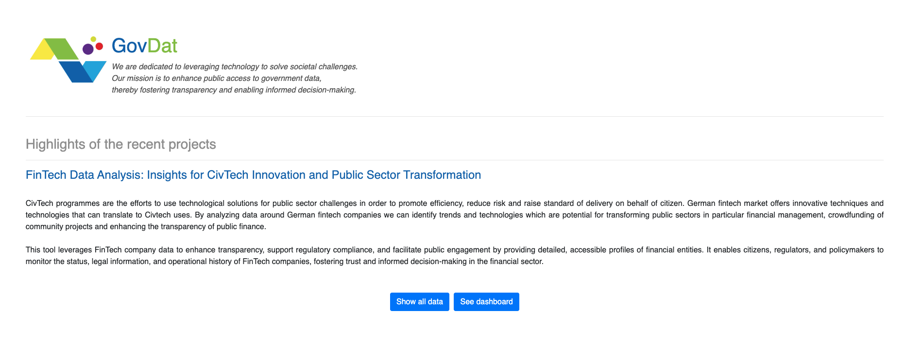
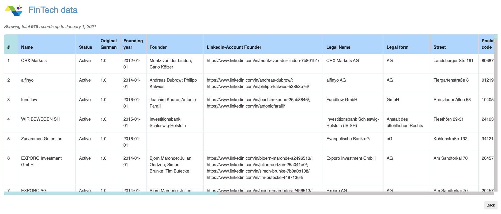
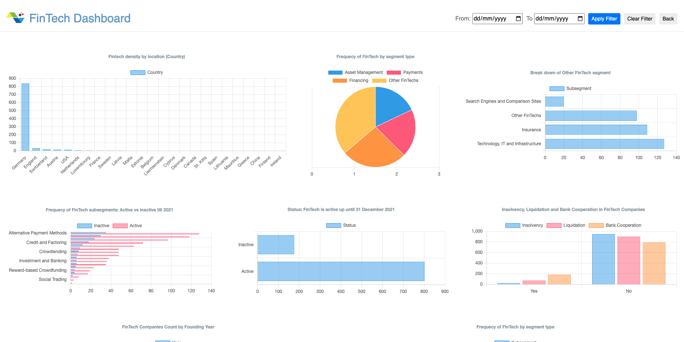

# FinTech Data Analysis: Insights for CivTech Innovation and Public Sector Transformation

CivTech programmes are the efforts to use technological solutions for public sector challenges in order to promote efficiency, reduce risk and raise standard of delivery on behalf of citizen. German fintech market offers innovative techniques and technologies that can translate to Civtech uses. By analyzing data around German fintech companies we can identify trends and technologies which are potential for transforming public sectors in particular financial management, crowdfunding of community projects and enhancing the transparency of public finance.

This tool leverages FinTech company data to enhance transparency, support regulatory compliance, and facilitate public engagement by providing detailed, accessible profiles of financial entities. It enables citizens, regulators, and policymakers to monitor the status, legal information, and operational history of FinTech companies, fostering trust and informed decision-making in the financial sector.

**This project was developed as an assignment for the Advanced Computer Programming (M605A) course.**

The fintech data was downloaded from here: [Kaggle Link](https://www.kaggle.com/datasets/desalegngeb/german-fintech-companies)

We uploaded the data in this location: src/data/German_FinTechCompanies.csv

_Due to the authentication issue, we could not read data directly from kaggle._

Currently, it has three pages:

1. Landing Page
2. All Data
3. Dashboard

## 1. Landing Page

## 2. All Data

It shows all the records used in our project. The records are up to January 1, 2021.

## 3. Dashboard

This is an interactive visualizer for the fintech data, which can be filtered by date.

## How to Install Dependencies and Run the Project

   **Step 1:** Install python3. (Minimum version 3.11.x, if the version is < 3.11.x , please upgrade)  
   **Step 2:** Run the following command from your terminal where the project is located: `pip3 install virtualenv`.    
   
  ( _If you get an error try running this command with the --break-system-packages flag instead:  `pip3 install virtualenv --break-system-packages`._  )

   **Step 3:** Run the following command: `virtualenv env`.       
   **Step 4:** For Mac or Linux, run the following command: `source env/bin/activate`. For Windows, run this instead: `env\scripts\activate.bat`.  
   **Step 6:** Run the following command: `pip3 install -r requirements.txt`.   
   **Step 7:** Run the following command: `python3 app.py`. Also you can run the script `sh ./run.sh` for mac or linux (change the script for windows)

   The application should now be running using this URL: [http://127.0.0.1:5000](http://127.0.0.1:5000)

## Running Unit Tests

From the terminal, run `sh ./test.sh` for Mac or Linux. For Windows, modify the `test.sh` file to activate the virtual environment and then run it.

Another option is to first activate the virtual environment and then run `python3 -m pytest`.

